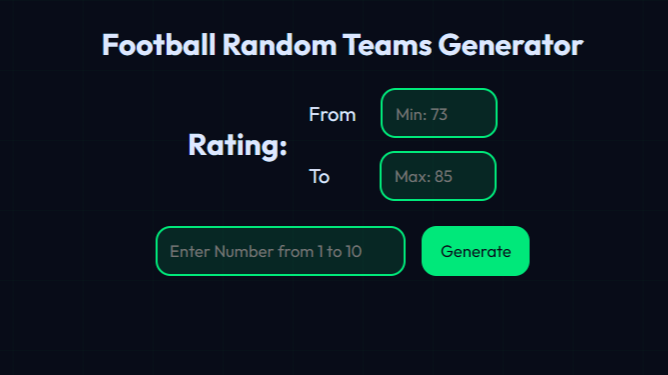

# ⚽ FootyZone - Football Random Teams Generator


---

## 🖼️ Preview



---

<p align="center">
  
  
</p>

> 🎯 A modern web app that generates random football teams based on rating and number of players.

---

## 📌 Overview

**FootyZone** is a simple yet powerful project built using **Vanilla JavaScript** that allows users to:

- Generate random football teams 🎲
- Filter teams based on rating ⭐
- Select number of teams (players) 👥

💡 This project is created **for educational purposes only** to practice front-end development skills.

---

## ✨ Features

- ⚡ Fast and lightweight (no frameworks)
- 🎯 Random team generator logic
- 🎨 Modern dark UI design
- 📊 Filter teams by rating range
- 🚫 Prevents duplicate teams
- 📱 Responsive layout

---

## 🌐 Live Demo

🔗 [https://mosokara.github.io/FootyZone/](https://mosokara.github.io/FootyZone/)

---

## 📥 Installation

Clone the repository:

```bash
git clone https://github.com/MoSokara/FootyZone.git
cd FootyZone
```

Then open `index.html` in your browser.

---

## 🛠️ Technologies Used

- HTML5
- CSS3 (Custom Properties + Modern UI)
- JavaScript (ES6 Modules)

---

## 📂 Project Structure

```
FootyZone/
│
├── index.html
├── styles.css
├── script.js
├── teams.js
└── assets/
    └── imgs/
```

---

## ⚠️ License & Usage

📌 This project is **NOT for commercial use**.

- ❌ You are NOT allowed to sell this project
- ❌ You are NOT allowed to use it in commercial products
- ✔️ You can use it for learning and personal projects
- ✔️ You can modify and improve it

⚠️ Some images/logos may belong to their respective owners and are used for demonstration only.

---

## 👨‍💻 Author

**Mohamed Abdulghani Eid Sokara**
💻 Computer Science Student

---

## 📬 Contact Me

- 📧 Email: [mosokara2007@gmail.com](mailto:mosokara2007@gmail.com)
- 🌐 Portfolio: [https://mosokara.netlify.app/](https://mosokara.netlify.app/)
- 💼 LinkedIn: [https://www.linkedin.com/in/mosokara](https://www.linkedin.com/in/mosokara)
- 🐙 GitHub: [https://github.com/MoSokara](https://github.com/MoSokara)
- 📘 Facebook: [https://www.facebook.com/share/1Hcx93GXj7/](https://www.facebook.com/share/1Hcx93GXj7/)
- 🐦 Twitter (X): [https://x.com/Mo_Sokara](https://x.com/Mo_Sokara)
- 📸 Instagram: [https://www.instagram.com/mosokara01/](https://www.instagram.com/mosokara01/)
- ▶️ YouTube: [https://www.youtube.com/channel/UCc1bUS1LMBq9aiprI_YC9xA](https://www.youtube.com/channel/UCc1bUS1LMBq9aiprI_YC9xA)

---

## 🧠 About Me

> My name is Mohamed Abdulghani Eid Sokara, I'm an Egyptian Computer Science student.
> I love coding, football, and building creative projects.

⚽ Football Lover
💻 Passionate Developer
🇪🇬 Proud Egyptian

---

## 🏁 My Slogan

> ✨ _Coding is my art, and bugs are my puzzles._

---

## ⭐ Support

If you like this project, don't forget to:

- ⭐ Star the repo
- 🍴 Fork it
- 📢 Share it

---

🔥 _Keep coding and improving!_
